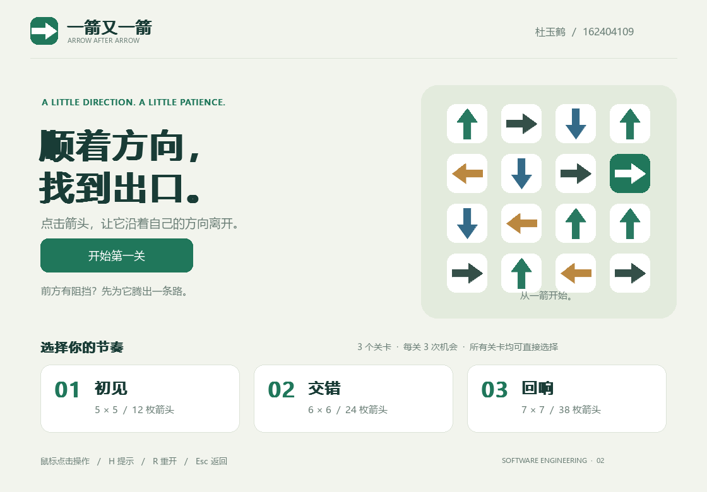
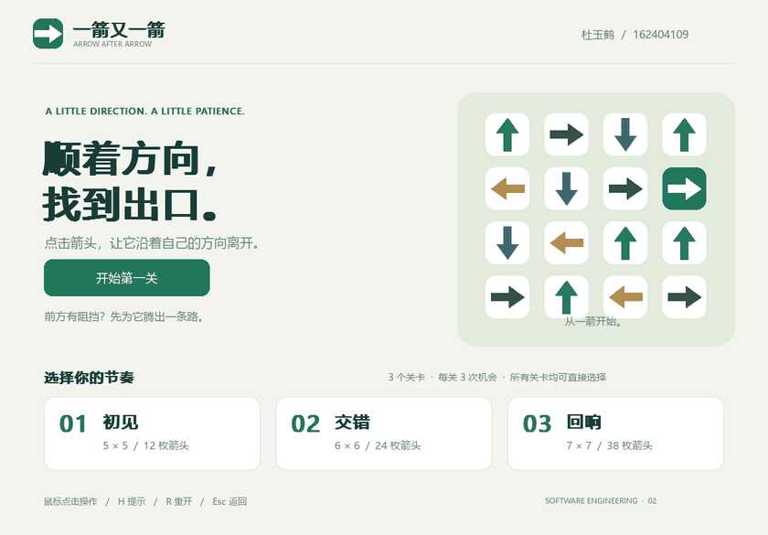
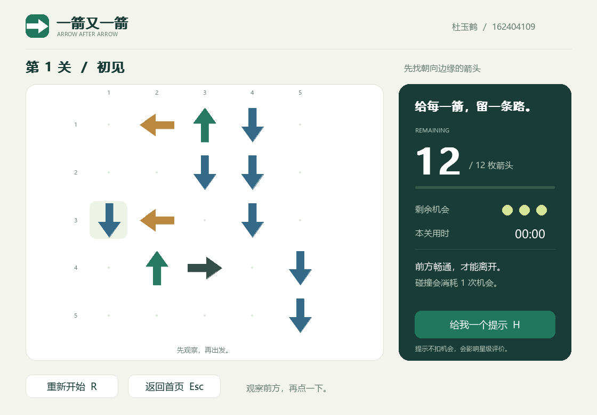
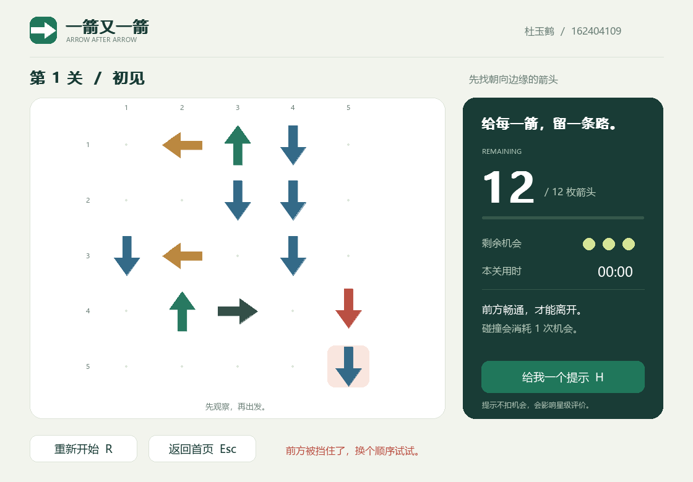
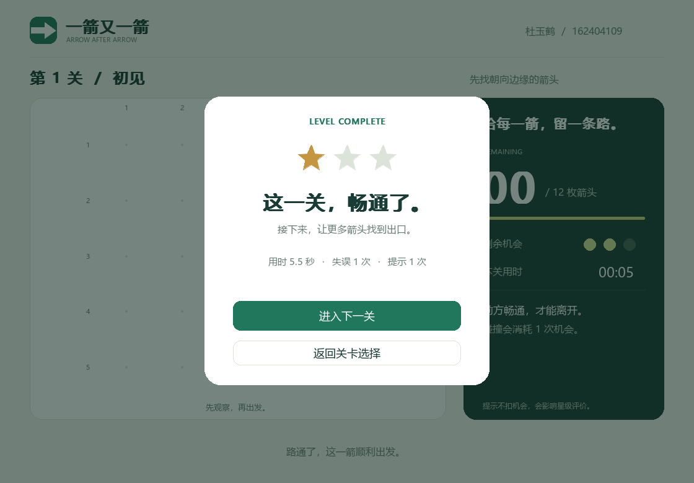
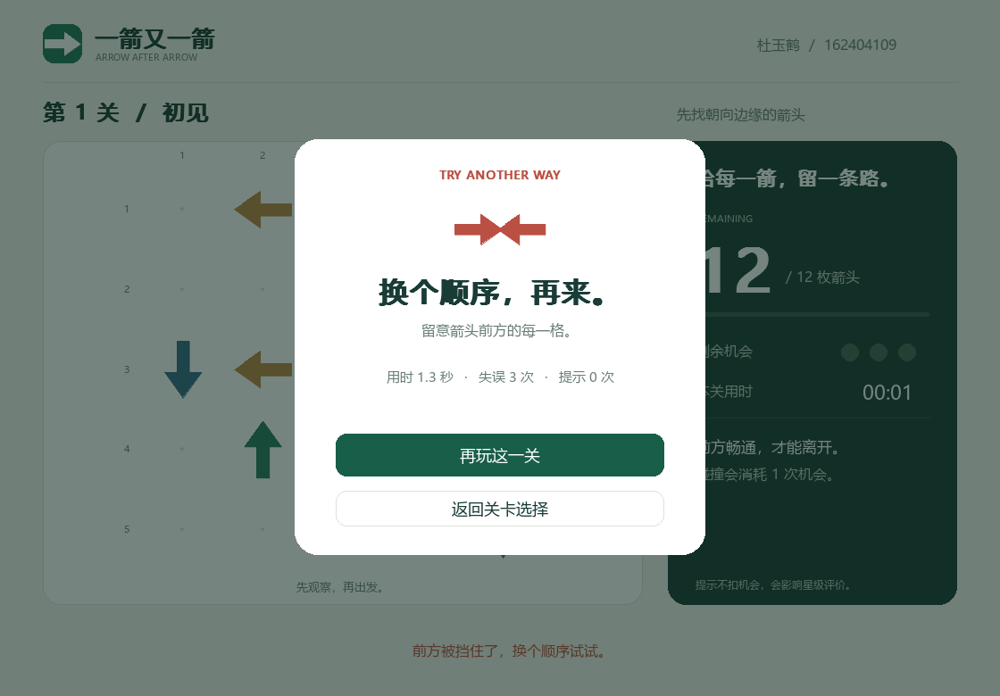

# 一箭又一箭

> 顺着方向，找到出口。

Python + pygame-ce 编写的单格箭头解谜游戏。作者：杜玉鹤（162404109）。
福州大学 202601 软件工程第二次个人作业。



## 游戏简介

点击朝向上、下、左、右的箭头。前方直到棋盘边界之间没有其他箭头时，箭头飞出并消失；否则播放红色晃动反馈并扣除一次机会。每关 3 次机会，清空棋盘即可通关，机会耗尽则失败。可以随时重新开始当前关卡。

|关卡|棋盘|箭头数量|初始可移除箭头|
|---|---|---:|---:|
|初见|5 × 5|12|5|
|交错|6 × 6|24|8|
|回响|7 × 7|38|10|

界面包含开始、游戏、通关、失败和暂停画面。附加功能：直接选关、合法箭头提示、计时、星级、本次运行内记录完成情况、失焦自动暂停。星级为 `max(1, 3 - 失误次数 - 提示次数)`，只在通关时计算；计时不影响星级。



上述素材由程序真实渲染，通过自动化鼠标事件采集；它们不是手工绘制的效果图，也不表示提交者已经完成本人试玩。

## 开发环境

- 实际验证：Windows、Python 3.14.5、pygame-ce 2.5.8。
- 建议 Python 3.12—3.14。规则与状态测试采用标准库 unittest。
- 游戏运行只需要 pygame-ce；Pillow 用于导出 GIF，PyInstaller 用于打包，均为可选开发依赖。
- Windows 自动使用系统微软雅黑。macOS/Linux 需安装可用的中文字体，如 Noto Sans CJK；这些平台未做实机验证。
- 无网络请求、无 API Key、无外部图片或音频资源。关卡数据随代码提供。

## 安装与运行

```bash
git clone https://github.com/myp208116/arrow-game.git
cd arrow-game
python -m venv .venv
```

Windows：

```powershell
.venv\Scripts\python.exe -m pip install -r requirements.txt
.venv\Scripts\python.exe main.py
```

macOS/Linux（未实机验证）：

```bash
.venv/bin/python -m pip install -r requirements.txt
.venv/bin/python main.py
```

Windows 用户也可以在安装依赖后双击 `start.cmd`。若项目中存在 `dist/ArrowGame.exe`，启动器会优先运行该独立程序；否则运行 Python 版本。源代码仓库不存放二进制程序。

## 操作说明

|操作|作用|
|---|---|
|鼠标左键点箭头|尝试消除；动画期间重复点击会被忽略|
|H 或“给我一个提示”|高亮一个可移除箭头 3 秒；影响星级，不扣机会|
|R 或“重新开始”|恢复本关初始棋盘、3 次机会、计时和提示计数|
|Esc 或“返回首页”|回到开始界面，可重新选关|
|通关后“进入下一关”|进入下一关；最后一关提供重玩和首页按钮|
|切换到其他窗口|自动暂停；点击“继续游戏”或按空格/回车恢复|

## 实现结构

```text
main.py                  程序入口
arrow_game/core.py       坐标、路径检测、游戏状态和求解器
arrow_game/levels.py     关卡加载与可解构造算法
arrow_game/levels.json   三个固定原创关卡
arrow_game/app.py        绘制、鼠标事件、动画与场景切换
tests/                  规则与界面测试
scripts/                关卡生成、验证报告、截图/GIF 导出
docs/                   博客稿、开发记录、测试结果和实际运行素材
```

坐标统一为 `(row, col)`。路径检测从箭头前方第一格开始，每次加方向向量，先检查边界，再检查占用。四个方向分别为 `(-1,0)`、`(1,0)`、`(0,-1)`、`(0,1)`。单次检测复杂度为 O(max(rows, cols))，不会让 Python 的负索引绕到棋盘另一侧。

关卡生成先随机选择占用位置，再反复为“当前能飞出的格子”选择合法方向并移除该占用。记录下来的顺序天然构成解法。独立求解器随后再次复核每个正式关卡。已输出以 1 为起点的行列解法：[solutions.json](docs/solutions.json)。

界面只负责动画和交互。动画开始后锁定箭头输入，完成后才提交一次逻辑操作；重开会丢弃未完成动画，避免旧动画影响新棋盘。

## 测试与复现

```powershell
.venv\Scripts\python.exe -m unittest discover -s tests -v
.venv\Scripts\python.exe scripts\verify.py
```

23 项测试通过，覆盖原题 T01—T06、四个方向及四个边界、无效点击、阻挡循环、125 个可解生成布局、三关完整鼠标事件流程、动画防连点、动画期间重开、失焦暂停和提示。

- [测试说明](docs/testing.md)
- [机器可读测试结果](docs/test-report.json)
- [原始测试输出](docs/test-output.txt)

需要重做截图/GIF 或打包时：

```powershell
.venv\Scripts\python.exe -m pip install -r requirements-dev.txt
.venv\Scripts\python.exe scripts\capture_demo.py
.venv\Scripts\python.exe -m PyInstaller --noconfirm --clean --onefile --windowed --name ArrowGame --add-data "arrow_game/levels.json;arrow_game" main.py
```

可执行文件输出到 `dist/ArrowGame.exe`。`main.py --smoke-test` 或 `ArrowGame.exe --smoke-test` 可进行离屏启动检查。

## 展示






## AIGC 与素材声明

本项目由提交者提出需求并使用 Codex 协作完成。AI 参与需求整理、规则、界面、测试和文档制作；未声称这些代码均为本人手写。真实阶段记录见 [development.md](docs/development.md)。

箭头、按钮、配色和关卡均在本项目中创建，未使用原商业游戏或其他同学的完整项目、代码、素材或关卡。中文字体调用操作系统已有字体，不复制或分发字体文件。

参考资料：[原作业](https://edu.cnblogs.com/campus/fzu/202601SofwareEngineering/homework/16717)、[pygame-ce 官方文档](https://pyga.me/docs/)、[Python unittest 官方文档](https://docs.python.org/3/library/unittest.html)。

